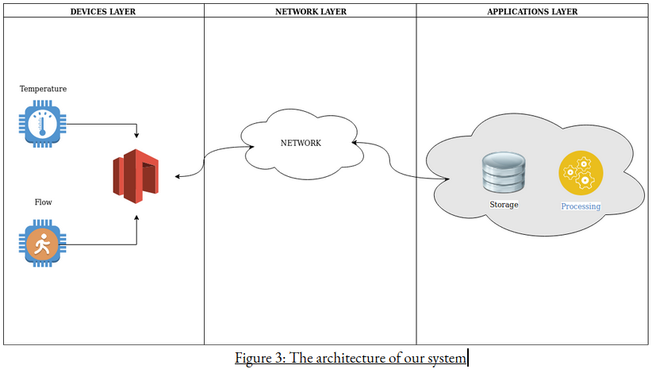
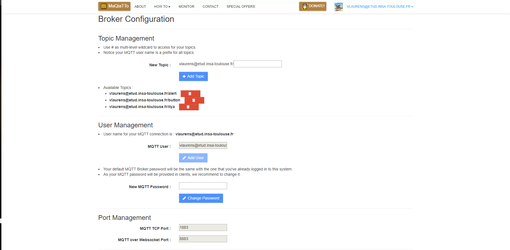
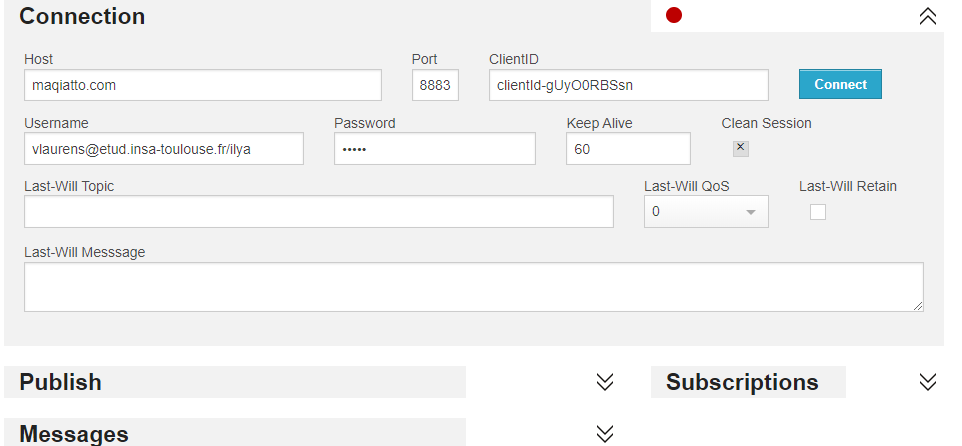

# Sensibilisation tool to save water and energy

Written by ILYA team

# Table of Contents
1. [Introduction](#introduction)
2. [TreeMap of the repository](#paragraph1)
3. [Architecture of the solution](#paragraph2)
4. [Device Layer](#paragraph3)
5. [Network Layer](#paragraph4)
6. [Application Layer](#paragraph5)
7. [VM](#paragraph7)
8. [Deployment](#paragraph8)

## Introduction <a name="introduction"></a>

Nowadays, people are becoming increasingly concerned about the future of our planet. The consequences of climate change are worse every year. Fighting against it has become a source of inspiration for many young entrepreneurs. ILYA is a young startup that is developing two products: a cyclic shower to reduce water consumption and an awareness tool to sensitive people to save water, energy and therefore money when taking a shower. In this report, we present in detail the second product, a tool that allows measuring in real-time the water and energy consumption during a shower. The prototype we developed consists of a sensor system that collects data on the water flow and quantity, stores it in a database, and then display an analysis of this data on a web interface.  The data is captured by an autonomous and energy-efficient node and is then sent via WiFi to a local server to be stored in a database and then on the cloud. The final prototype is not fully optimized but both simple and realistic.


## TreeMap of the repository <a name="paragraph1"></a>
```
Project ILYA
    |-README
    |-Documentation
    |   |-rapport.pdf
    |   |-Presentation.pdf
    |-DeviceLayer
    |   |-ESP_Code
    |-ApplicationLayer
    |   |-data_structure_api
    |   |-UI
    |-VM
    |   |-README
```


## Architecture of the solution <a name="paragraph2"></a>




## Device Layer <a name="paragraph3"></a>

The Device layer is Composed of 4 different components for one module.
There are 2 sensors , 1 Microcontroller, 1 Shield.
This is the Bom of our Module:

|DEVICE NAME	                       |Quantity |
| -----------------------------------: | ------: |
|Grove - Temperature Sensor V1.2       |    x1   |
|YFS-201 Hall Effect Water Flow Sensor |    x1   |
|Node-MCU ESP8266	X1                 |    x1   |
|Grove Base Shield for NodeMCU         |    x1   |

The Arduino Code can retrieve data from sensors during a certain period : each 10 sec
Number of acquisition : 7 , Total time of acquisition : 70 sec.

This parameters are configurable in the source code which is commented to know the purposes of functions and variables
<a href="https://drive.google.com/file/d/1UWVMobrCpHeJf4AdiO7gw0xYP0oA8SGS/view?usp=sharing">Bill of Material (document)</a>


## Network Layer <a name="paragraph4"></a>

1.  Create an account on http://maqiatto.com
   Click on "CREATE ACCOUNT"
   Create your account
2.  After login, clic on your email address on the left top corner
   On the dropdown menu clic on "Broker configuration"
3.  Next page should appear
    
    ADD the same topics as shown on the figure (cf First part :Device Layer where you have to replace created topic on the  global code variables)
4. Once differents topics are created you can monitor reception of JSON object by connecting to the http://www.hivemq.com/demos/websocket-client/ on a private window in your browser.
    Then you have to fill all the fields as shown in the next figure
    
    Note that vlaurens@etud.insa-toulouse.fr/ilya is the main topic where all data are going to be sent. ( <maqiattoUsername>/ilya ingeneral).
 Ajouter image après  connexion

## Application Layer <a name="paragraph5"></a>

You can deploy the application either on a Ubuntu Virtual Machine or by deploying containers as describe in part 7 or on your computer if you have python installed but you will need to install some python modules using command and install mongo (https://docs.mongodb.com/manual/installation/) and for configuring data base mongodb-compass (https://www.mongodb.com/products/compass)
````
$  sudo apt-get update && apt-get install -y apt-utils && apt-get install -y python && apt-get install -y python-pip && pip install requests && pip install flask && pip install flask_restplus && pip install paho-mqtt && pip install pymongo
````
Then if you decide to install on your machine you have to install npm and nodejs (https://nodejs.org/fr/download/) to be able to install node-red and run the UI.

Then you will download the "ApplicationLayer/data_structure_api" folder from git repository
Move on the folder and run command:
````
$ python app.py
````

The API is ready to collect data from broker and store it on mongodb.

Then run 
````
$ node-red
````
Then open a browser and go on http://127.0.0.1:1880
If you can't show flows import the two flows which are on folder "ApplictionLayer/UI" as described on the following tutorial: https://nodered.org/docs/user-guide/editor/workspace/import-export.
  If some package are missing install "node-red-contrib-ui" via install menu of nodered.
    - Go on the same menu as import 
    - Choose "manage Palette"
    - Go on install package section
    - Search "node-red-contrib-ui" and install it
    - Exit and close "manage Palette" popup
    - Then Deploy Flow by clicking on "Deploy" Button.
    - Visit http://127.0.0.1:1880/ui
Then we present you a means to install a VM or the VM we prepare and do the same operation to deploy application on the VM.
We finally show how to deploy our application with containers docker instead of using VM. A better solution for a large scale deployment.
Notice : The VM can be deploy directly on a cloud platform.
## VM <a name="paragraph6"></a>
- Download the VM on the link : https://drive.google.com/drive/folders/14bD5Wj_I1dPEdrXSYJpSs-G7y7vcGLyr?usp=sharing
- Install VirtualBox and launch the VM. You can do like in this tutorial :<a href="https://www.vulgarisation-informatique.com/installer-virtualbox.php"> How to install VirtualBox and launch VM</a>
- Connect to the VM using  ilya/ilya then you have a document which explains every thing on the VM Desktop.
- Go on API folder
```bash 
  $ cd ~/Documents/API/data_structure_api/
  ```
 - Run the API like describe on Application Layer section:
 ````
$ python app.py
````
- Open a browser and enter http://127.0.0.1:1880/ui to show dashboards.
- If you can't access it:
- Run on a Terminal (ctrl+Alt+T) : node-red  command
 ```bash 
  $ node-red
  ```
- Then go on http://127.0.0.1:1880 you will see code of flows and then you can modify them or deploy them.
  You will find flows on 
  ```bash 
  $ cd ~/Documents/API/UI/
  ```
  If you can't show them import the two flows which are on folder "ApplictionLayer/UI" as described on the following tutorial: https://nodered.org/docs/user-guide/editor/workspace/import-export.
  If some package are missing install "node-red-contrib-ui" via install menu of nodered.
    - Go on the same menu as import 
    - Choose "manage Palette"
    - Go on install package section
    - Search "node-red-contrib-ui" and install it
    - Exit and close "manage Palette" popup
    - Then Deploy Flow by clicking on "Deploy" Button.
    - Visit http://127.0.0.1:1880/ui
  
  If you want to monitor DataBase you can open a terminal (you can use shortcut ctrl+Alt+T) enter the command : "mongodb-compass&"
- Then open a browser and see the interface. enter 127.0.0.1:27017 and press enter.
  You will see all the databases. The databases are created by the API at the first data reception.
  
  <a src="./VM/README.md">VM Documentation</a>
  
## How to deploy our services on cloud by barely method or using a host OS <a name="paragraph7"></a>

In folder "services" run following command to deploy services
```bash
$ docker-compose up -d
```
run following command to stop all services
```bash
$ docker-compose down
```

Then open 127.0.0.1:1880 and on the interface
select menu on the top-right corner
In the menu select "manage palette" and in install menu
Install node-red-dashboards

Then select import menu and import two json file which are located in folder ilyaUI directory


